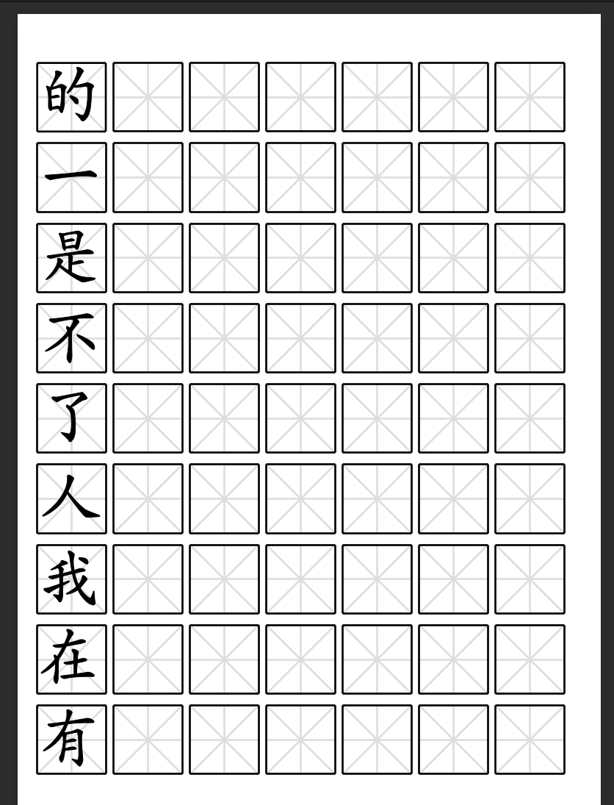
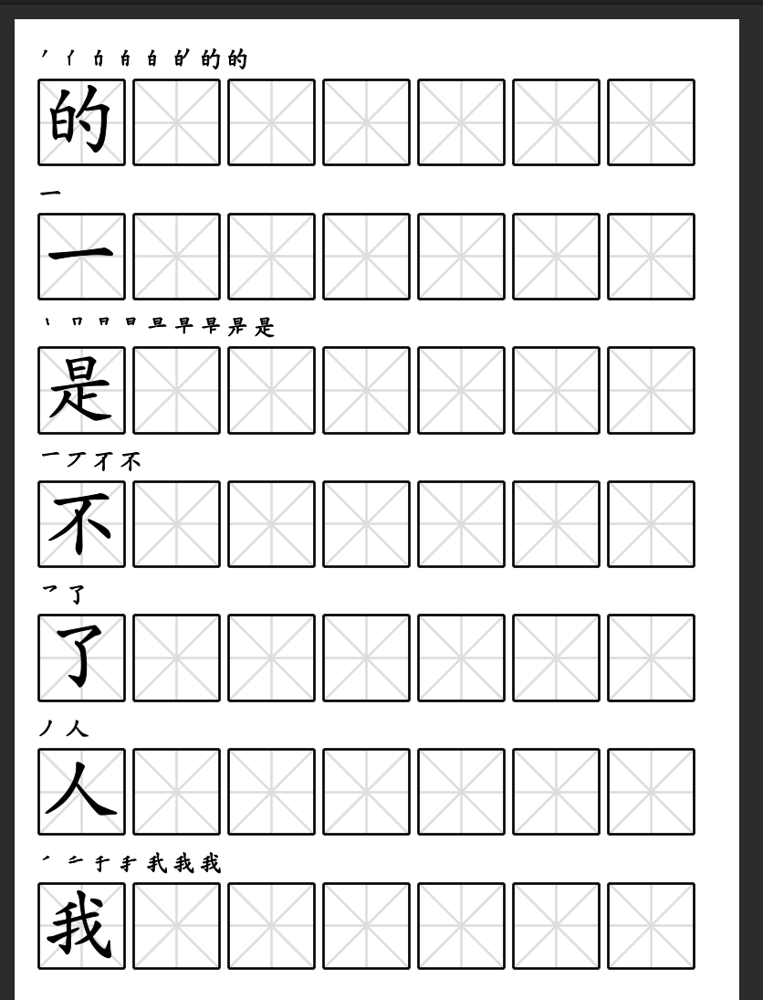
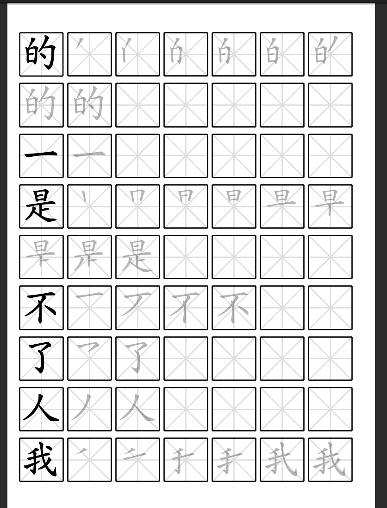

# Hanzi Worksheet Generator

A simple command-line utitlity to generate Hanzi Worksheets. Optimized for the Supernote with Top-bar or Right-bar.

## Reqirements

- NodeJS > v16

## Install

`yarn install` or `npm install`

## Run

`node ./index.js [...options]`

## Options

### -f, --filename

Where to save the generated file.

Default: `test.pdf`

### -c, --characters

A string containing the characters to include in the worksheet. Each character will be split into a separate line. Don't include spaces or punctuation.

Default: `的一是不了人我在有他这为之大来以个中上们`

### -s, --size

The paper size to use. Currently only supports A6.

Default: `A6`

### -hh, --hint

Include hint line that shows the stroke order. Will be disabled if `--tracing` is enabled.

Default: `false`

### -t, --tracing

Include tracing hints on the grid.

Default: `false`

## Dependencies

No need to install these separately, just for convenience if you want to edit the code.

- [PDFKit](https://pdfkit.org/docs/)
- [Hanzi Writer](https://hanziwriter.org/docs.html)

## Future Features

- [ ] Support more page sizes
- [ ] Option to add more practice lines
- [ ] Color options
- [ ] Option to display pinyin
- [ ] Option to display definition

